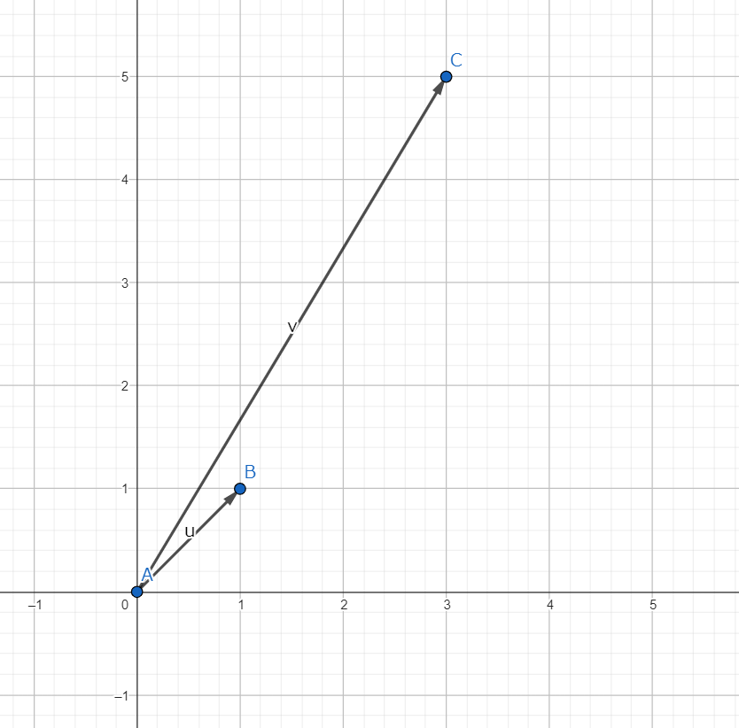
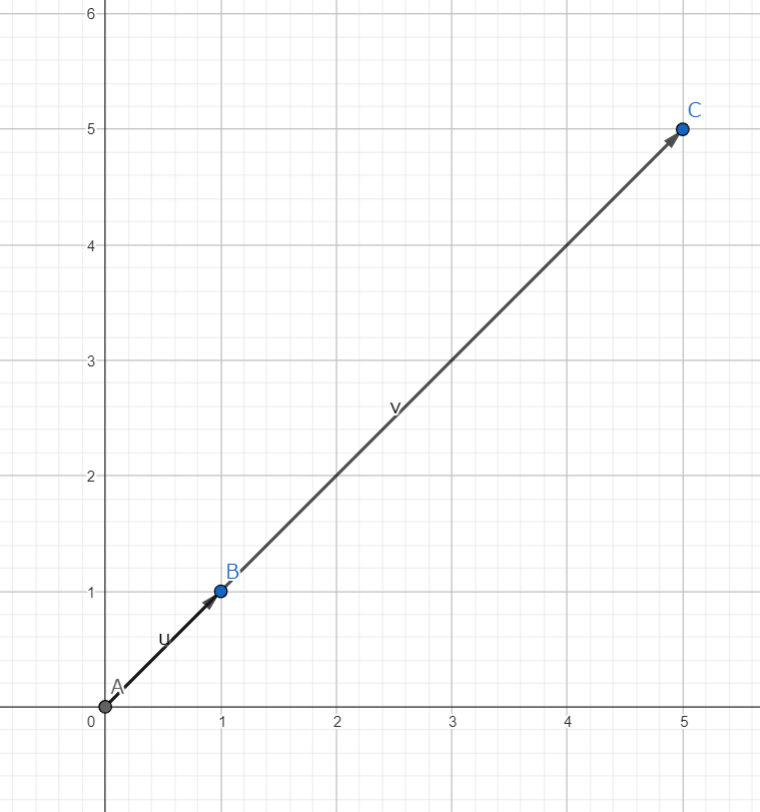

まず、固有値・固有ベクトルの定義を確認する。

 

$$
A{\vec{x}} = \lambda{\vec{x}}
$$

 

$
A = {
  \begin{pmatrix}
    a & b \\
    c & d
  \end{pmatrix}
}
$
、$\vec{x}={
\begin{pmatrix}
x\\
y
\end{pmatrix}
}
$、$\lambda$は実数とする。

ここで、上の式が成り立つとき、$\lambda$を**固有値**、$\vec{x}$を**固有ベクトル**という。

この式が何を意味しているのか図解する。

具体的な例として、$A=
{\begin{pmatrix}
 3 & 2\\
 1 & 2
\end{pmatrix}}$、$\vec{x}=
{\begin{pmatrix}
 1\\
 1
\end{pmatrix}}$の場合を考える。
$A\vec{x}={
{\begin{pmatrix}
 3 & 2\\
 1 & 2
\end{pmatrix}}
}
{\begin{pmatrix}
 1\\
 1
\end{pmatrix}}={
\begin{pmatrix}
 3\times{1}+2\times{1}\\
 1\times{1}+2\times{1}
\end{pmatrix}}={
\begin{pmatrix}
 5\\
 3
\end{pmatrix}}$である。
以下に$\vec{x}$と$A\vec{x}$のベクトルを示す。

グラフにおいて、$\overrightarrow{AB}=\vec{x}={
\begin{pmatrix}
1\\
1
\end{pmatrix}
}$、$\overrightarrow{AC}=A\vec{x}={
\begin{pmatrix}
5\\
3
\end{pmatrix}
}$

次に、$A={
\begin{pmatrix}
2 & 3\\
1 & 4
\end{pmatrix}
}$の場合を考える。
$A\vec{x}={
{\begin{pmatrix}
 2 & 3\\
 1 & 4
\end{pmatrix}}
}
{\begin{pmatrix}
 1\\
 1
\end{pmatrix}}={
\begin{pmatrix}
 2\times{1}+3\times{1}\\
 1\times{1}+4\times{1}
\end{pmatrix}}={
\begin{pmatrix}
 5\\
 5
\end{pmatrix}}$

以下に$\vec{x}$と$A\vec{x}$のベクトルを示す。

グラフにおいて、$\overrightarrow{AB}=\vec{x}={
\begin{pmatrix}
1\\
1
\end{pmatrix}
}$、$\overrightarrow{AC}=A\vec{x}={
\begin{pmatrix}
5\\
5
\end{pmatrix}
}$

ここで、$A=
{\begin{pmatrix}
 3 & 2\\
 1 & 2
\end{pmatrix}}$のときとは違い、次が成り立つ。

 

$$
A\vec{x}={
\begin{pmatrix}
5\\
5
\end{pmatrix}
}
=
5
{
\begin{pmatrix}
1\\
1
\end{pmatrix}
}
$$

 

この時の$5$が$A$の固有値$\lambda$である。

すなわち固有値$\lambda$とは、**あるベクトル$\vec{x}$に行列$A$をかけたときに、元のベクトルの何倍になったかを表す値である**。
